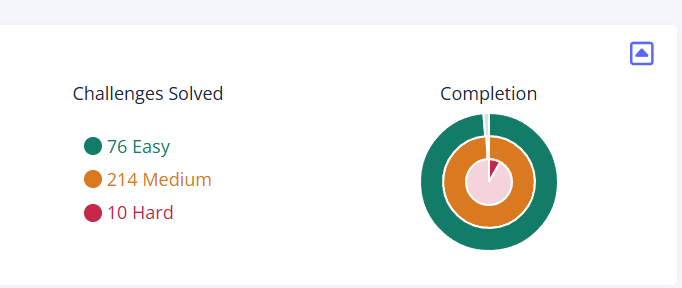

## 我在幹嘛

 

<picture>
  <source media="(prefers-color-scheme: light)" srcset="https://raw.githubusercontent.com/kokoyori-sekainiitamio/kokoyori-sekainiitamio/output/github-snake.svg" />
  <source media="(prefers-color-scheme: dark)" srcset="https://raw.githubusercontent.com/kokoyori-sekainiitamio/kokoyori-sekainiitamio/output/github-snake.svg" />
  
</picture>

  

[picoCTF網址](https://picoctf.org/)
[自製作品](https://kokoyori-sekainiitamio.github.io/2025/06/01/%E6%9C%AA%E4%BE%86%E6%BB%B2%E9%80%8F%E6%80%9D%E8%B7%AF/)

